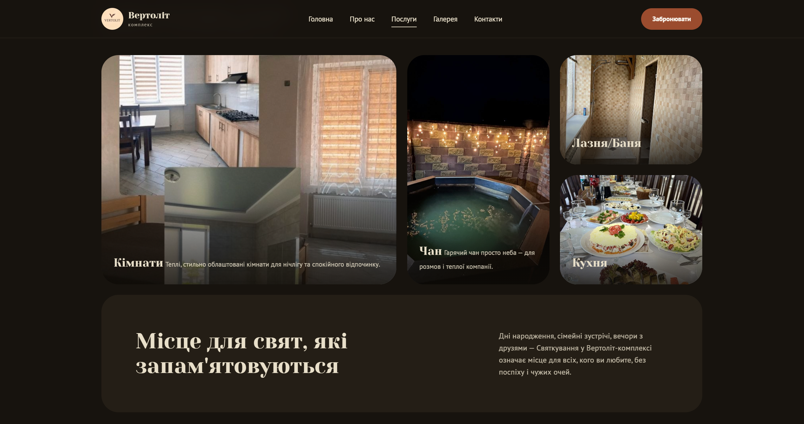
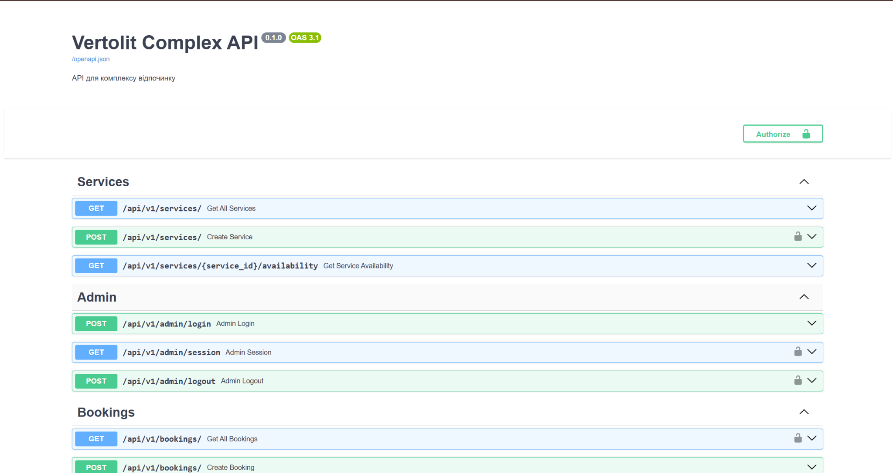

# Vertolit Complex

Backend system for a leisure complex built with FastAPI and PostgreSQL.

The application provides REST API functionality for managing services, bookings,
availability, administrative operations, and background notifications.

## Features

- Service management
- Booking creation and management
- Availability checking
- Availability blocks
- Booking conflict protection
- Admin sessions
- Background notifications and reminders
- Asynchronous database operations
- Automated tests
- Dockerized development environment

## Tech Stack

### Backend

- Python
- FastAPI
- Pydantic
- SQLAlchemy
- Alembic

### Database

- PostgreSQL
- asyncpg

### Background Tasks

- Celery
- Redis

### Infrastructure

- Docker
- Docker Compose
- Nginx
- GitHub Actions

### Testing

- Pytest
- Async tests

## Project Structure

```text
VertolitProject/
├── backend/
│   ├── app/
│   ├── alembic/
│   └── tests/
│
├── frontend/
│
├── .github/
│   └── workflows/
│
├── docker-compose.yml
└── docker-compose.prod.yml
```

## API Documentation

After starting the backend, interactive API documentation is available at:

- Swagger UI: `/docs`
- ReDoc: `/redoc`

## Running the Project

Clone the repository:

```bash
git clone https://github.com/Qwerty-polo/VertolitProject.git
cd VertolitProject
```

Start the application with Docker:

```bash
docker compose up --build
```

## Screenshots

### Frontend



### API Documentation



## Author

**Maxym Burlak**  
Junior Python Backend Developer

- GitHub: https://github.com/Qwerty-polo
- LinkedIn: https://www.linkedin.com/in/maxym-burlak-7024773b3/
